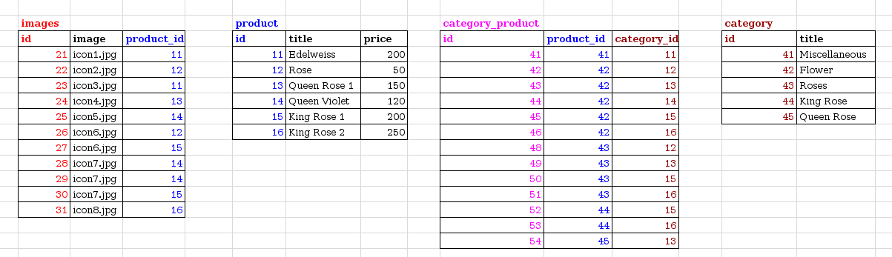

#Composite DS

Для тог, что бы создать такую структуру с данными, выполните инструкции по  
[установке библиотеки](INSTALL.md "установка библиотеки zaboy-rest") и по  
[запуску тестов](TESTS.md "Подготовка к запуску тестов").
Потом выполните скрипт `script/install.php`, он создаст таблицы с данными в базе.

DataStore основаный на DbTable позволяющй получать данные из связаных таблиц.
Допустим мы имеет таблицу и справочник, они имеют один ко многим
Ecли мы отправим запрос в таблицу - получим запись из таблици с массивом данных из справочника,
А отправив запрос в справочник - получим запись из справочника с полями из таблцы.

Именем ресурса у нас может быть как таблица так и справочник. Но относительно выбраного ресурса
будет менятся тип ответа.

Что бы связать таблицы нужно указать обязательно указывать foreign key при их создании.

> !В данный момент операции put(update), post(create), delete - не работают.

# Типы связей 

* многие к одному - левая сторона связи (многие) имеет foreign key на правую (один)
* один ко многим - правая сторона связи (многие) имеет foreign key на левую (один)
* многие ко многим - обе стороны не имеют foreign key друг на друга, но существует таблица связи которая имеет оба foreign key

Связи могут быть вложеными, и обрабатываются с лева на право, в глубину.

# Примеры запросов

Изначально будет выдаватся только 0 уровень вложености.
> Пример 1.0: select()

Что бы запросить выдачу связей нужно явно указать имя связаной таблицы в поле select
> Пример 1.1: select(product.)

Если мы захотим указать вложеную связь мы указываем имя таблицы со звездочкой
> Пример 1.2: select(product.#)

Тогда будут выбраны все изображения для данной таблицы, а так же включая первый уровень вложености для изображений.
Запись видда
> Пример 1.3: select(product.#, product.images.) 

Даст тот же результат что и в примере 1.2, так как был возвращен первый уровень вложености.   

Дополнительные уровни вложености указываются идентично 
> Пример 1.4: select(images.#, images.product.#)

Что бы получить конкретное поле для связаной таблици мы указываем нужное поле через точу после имени связаной таблцы.
> Пример 1.5: select(images.image)

  

