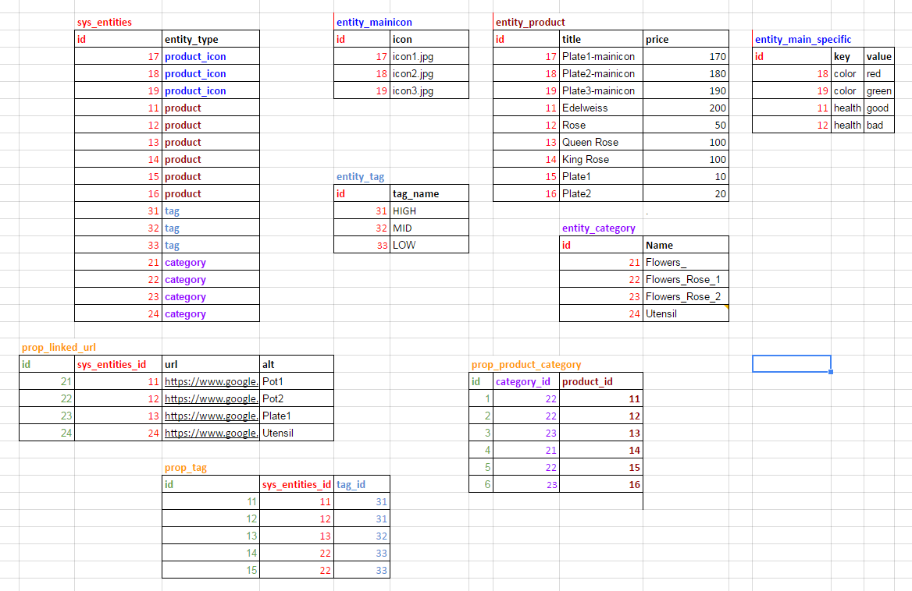

# EAV example

# Структура таблиц

Выполните 
Запустите команду `composer lib-install`, он [создаст таблицы](https://docs.google.com/spreadsheets/d/1k51Dtv1z-eK_ic5TXJMdJ9_jeLBtcrKQPQI9A0Jpts0/edit#gid=0) примера в базе.  

  


Для тог, что бы создать такую структуру с данными, выполните инструкции по  
[установке библиотеки](INSTALL.md "установка библиотеки zaboy-rest") и по  
[запуску тестов](TESTS.md "Подготовка к запуску тестов").

## Теперь должно работать: ##

[http://zaboy-rest.loc//api/rest/entity_tag](http://zaboy-rest.loc//api/rest/entity_tag)

### prop таблицы можно добавлять в select как поля. ###

[http://zaboy-rest.loc//api/rest/entity_category?select(prop_product_category)](http://zaboy-rest.loc//api/rest/entity_category?select(prop_product_category)) 

[http://zaboy-rest.loc//api/rest/entity_product?select(id,title,price,prop_linked_url)](http://zaboy-rest.loc//api/rest/entity_product?select(id,title,price,prop_linked_url))

[http://zaboy-rest.loc//api/rest/entity_product?select(id,title,price,prop_linked_url)&gt(price,50)](http://zaboy-rest.loc//api/rest/entity_product?select(id,title,price,prop_linked_url)&gt(price,50))

[http://zaboy-rest.loc//api/rest/entity_product?select(id,title,price,prop_linked_url)&gt(price,50)&limit(2,1)](http://zaboy-rest.loc//api/rest/entity_product?select(id,title,price,prop_linked_url)&gt(price,50)&limit(2,1))   


### или можно читать таблицы props и sys_entities "напрямую": ###

[http://zaboy-rest.loc//api/rest/prop_linked_url](http://zaboy-rest.loc//api/rest/prop_linked_url)

[http://zaboy-rest.loc//api/rest/sys_entities  ](http://zaboy-rest.loc//api/rest/sys_entities  )


(Писать так не рекомендуется.)

### Можно "горизонтально" расширять таблицы ###

Например у таблицы entity_product есть наследники:  

Продукт с иконкой:   
[http://zaboy-rest.loc/api/rest/entity_product-entity_main_specific](http://zaboy-rest.loc/api/rest/entity_product-entity_main_specific)   


Продукт со спецификом:   
[http://zaboy-rest.loc/api/rest/entity_mainicon-entity_main_specific](http://zaboy-rest.loc/api/rest/entity_mainicon-entity_main_specific)

И даже продукт и с иконкой и со спецификом:   
[http://zaboy-rest.loc/api/rest/entity_product-entity_mainicon-entity_main_specific](http://zaboy-rest.loc/api/rest/entity_product-entity_mainicon-entity_main_specific)

Давайте посмотрим какие таги назначены продуктам со спецификами:    
[http://zaboy-rest.loc/api/rest/entity_product-entity_main_specific?select(id,title,price,prop_tag)](http://zaboy-rest.loc/api/rest/entity_product-entity_main_specific?select(id,title,price,prop_tag))

Ну и прочие условия можно тоже добавить:   
[http://zaboy-rest.loc/api/rest/entity_product-entity_main_specific?select(id,title,price,prop_tag)&gt(price,50)&limit(2,1)](http://zaboy-rest.loc/api/rest/entity_product-entity_main_specific?select(id,title,price,prop_tag)&gt(price,50)&limit(2,1))

## Как объявить ресурс: ##

Когда Вам захочется переобозначить `entity_product-entity_mainicon-entity_main_specific` коротким именем ресурса,   
просто добавьте в конфиг файл:  

    'services' => [
        'aliases' => [
            'superproduct' =>
            'entity_product-entity_main_specific'
        ]
    ]

## Как создавать записи: ##


### Добавляем новую сущность   

Для начала, давайте обратим внимание на таблцы sys_entities и entity_product.
Допустим мы хотим добавить новый продукт, что бы это сделать нам нужно отправить POST запрос на
ресурс http://zaboy-rest.loc/api/rest/entity_product в теле которого передать json объект сущности product.

Пример:

Отправим запрос:
    `POST http://zaboy-rest.loc/api/rest/entity_product`
```
{
    "title": "Edelweiss",
    "price": "200",
}
```
Получим в ответ:
```
{
    "id": "12",
    "add_date": "2016-10-28",
    "title": "Edelweiss",
    "price": "200",
}
```
> (*) Поле id и add_date может у вас отличатся. 

Так же мы можем создавать новый объект используя (php) Entity DataStore напрямую.

Пример:

```php
    $createdElement = $entity->create([
        'title' => 'Edelweiss',
        'price' => 200
    ]);
```

### Добавляем новую сущность с пропс

Теперь давайте посмотрим еще на одну таблицу - prop_linked_url.
Это таблица типа - prop, c ее помощью мы можем расширить наш entity_producе.
Давайте создадим новый продукт, но уже вместе с linked_url.
Для этого мы так же должны отправить POST запрос на ресурс `http://zaboy-rest.loc/api/rest/entity_product`
в теле которого передать json объект сущности product а так же prop.

Пример:

Отправим запрос:
    `POST http://zaboy-rest.loc/api/rest/entity_product`
```
{
    "title": "Edelweiss",
    "price": "200",
    "prop_linked_url": [
        {"url": "http://google.com", "alt": "url_1"}
    ]
}
```
Получим в ответ:
```
{
    "id": "13",
    "add_date": "2016-10-28",
    "title": "Edelweiss",
    "price": "200",
    "prop_linked_url": [
            {
                "id": "25",
                "sys_entities_id": "13",
                "url": "http://google.com",
                "alt": "url_1"
            }
        ]
}
```

Как мы видим мы создали объект product в пропом linked_url.
Мы так же можем это сдлеать используя php Entity DataStore.

Пример:

```php
    $createdElement = $entity->create([
        'title' => 'Edelweiss',
        'price' => 200,
        'prop_linked_url' => [
            ['url' => 'http://google.com', 'alt' => 'url_1']
        ]
    ]);
```

### Обновляем сущность


Мы можем обновлять наши сущьности.
Давайте обновим наш ранее созданый продукт - изменим в нем цену
Для этого нужно отправить PUT запрос на ресурс `http://zaboy-rest.loc/api/rest/entity_product`
в теле которого передать json объект сущности product.

Пример:

Отправим запрос:
    `PUT http://zaboy-rest.loc/api/rest/entity_product`
```
{
    "id": "12"
    "title": "Edelweiss",
    "price": "400",
}
```
Получим в ответ:
```
{
    "id": "12",
    "add_date": "2016-10-28",
    "title": "Edelweiss",
    "price": "400",
}
```

Мы так же это можно сделать средствами php Entity DataStore.

Пример:

```php
    $updatedElement = $entity->update([
        'id' => '12'
        'title' => 'Edelweiss',
        'price' => 400
    ]);
```

### Обновляем сущность - управляем prop 

Давайте вернем наше внимание к таблицам prop.
Используя обновления объекта сущности, мы можем управлять его prop параметрами.

### Обновляем сущность - добавляем prop

Давайте добавим новый prop linked_url для нашего ранее зданного продукта.

Как мы помним, наш продукт (id = 13) уже обладает одним prop свойством, так как управление prop обектами
производится через операцию update (PUT) мы должны указать хотя бы id для всех prop свойств того типа который мы 
редактируем.


Пример:

Отправим запрос:
    `POST http://zaboy-rest.loc/api/rest/entity_product`
```
{
    "id": "13",
    "prop_linked_url": [
        {"id": "25"},
        {"url": "http://google.com-2", "alt": "url_2"},
    ]
}
```
Получим в ответ:
```
{
    "id": "13",
    "add_date": "2016-10-28",
    "title": "Edelweiss",
    "price": "200",
    "prop_linked_url": [
            {
                "id": "25",
                "sys_entities_id": "13",
                "url": "http://google.com",
                "alt": "url_1"
            },
            {
                "id": "26",
                "sys_entities_id": "13",
                "url": "http://google.com-2",
                "alt": "url_2"
            }
        ]
}
```
Как мы видим, мы создали новое prop свойство, при этом существующее осталось неизменным.

То же самое можно самое но используя php

Пример:

```php
    $updatedElement = $entity->update([
        'id' => '13'
        'prop_linked_url' => [
                    ['id' => '25'],
                    ['url' => 'http://google.com-2', 'alt' => 'url_2']
                ]
    ]);
```
### Обновляем сущность - обновляем prop

Теперь давайте обновим prop свойство у нашего продукта.
Для этого мы так же воспользуемся операцией update (put).
> Незабываем указывать (хотя бы) id для тех свойств который не хотим изменять в нашем продукте.

Пример:

Отправим запрос:
    `POST http://zaboy-rest.loc/api/rest/entity_product`
```
{
    "id": "13",
    "prop_linked_url": [
        {"id": "25"},
        {"id": "26", "url": "http://google.com-2-edit", "alt": "url_2-edit"},
    ]
}
```
Получим в ответ:
```
{
    "id": "13",
    "add_date": "2016-10-28",
    "title": "Edelweiss",
    "price": "200",
    "prop_linked_url": [
            {
                "id": "25",
                "sys_entities_id": "13",
                "url": "http://google.com",
                "alt": "url_1"
            },
            {
                "id": "26",
                "sys_entities_id": "13",
                "url": "http://google.com-2-edit",
                "alt": "url_2-edit"
            }
        ]
}
```

Как видно запись была обновлена.

То же самое, но используя php

Пример:

```php
    $updatedElement = $entity->update([
        'id' => '13'
        'prop_linked_url' => [
                    ['id' => '25'],
                    ['url' => 'http://google.com-2-edit', 'alt' => 'url_2-edit']
                ]
    ]);
```

### Обновляем сущность - удаляем prop

Теперь давайте удалим одно prop свойство.
Что бы удалить свойство из объекта, мы должны не указывать его при использовании update (put).

Пример:

Отправим запрос:
    `POST http://zaboy-rest.loc/api/rest/entity_product`
```
{
    "id": "13",
    "prop_linked_url": [
        {"id": "26"},
    ]
}
```
Получим в ответ:
```
{
    "id": "13",
    "add_date": "2016-10-28",
    "title": "Edelweiss",
    "price": "200",
    "prop_linked_url": [
            {
                "id": "26",
                "sys_entities_id": "13",
                "url": "http://google.com-2-edit",
                "alt": "url_2-edit"
            }
        ]
}
```
Как мы можем заметить, свойство было удалено.

То же самое - используя php

Пример:

```php
    $updatedElement = $entity->update([
        'id' => '13'
        'prop_linked_url' => [
                    ['id' => '26'],
                ]
    ]);
```

### Расширеная сущность - SuperEntity 


Теперь давайте посмотрим на таблицы entity_mainicon и entity_product.
Мы можем заменить что элементы 17, 18, 19 находятся в обеих таблцах, это потому что они связаны,
и представляют собой super entity или же комбинированную сущность.
Мы можем работать с подобными сущностями используя в качестве имени ресурса комбинацию их имен 
`http://zaboy-rest.loc/api/rest/entity_product-entity_mainicon`
Звеньев в составной сущности может быть не органиченое количество.

С подобными ресурсами мы можем работать точно так же как если бы это была одна сущность, по этому все практики
по работе с пропами и обычными сущностями будут работать и на составных.

